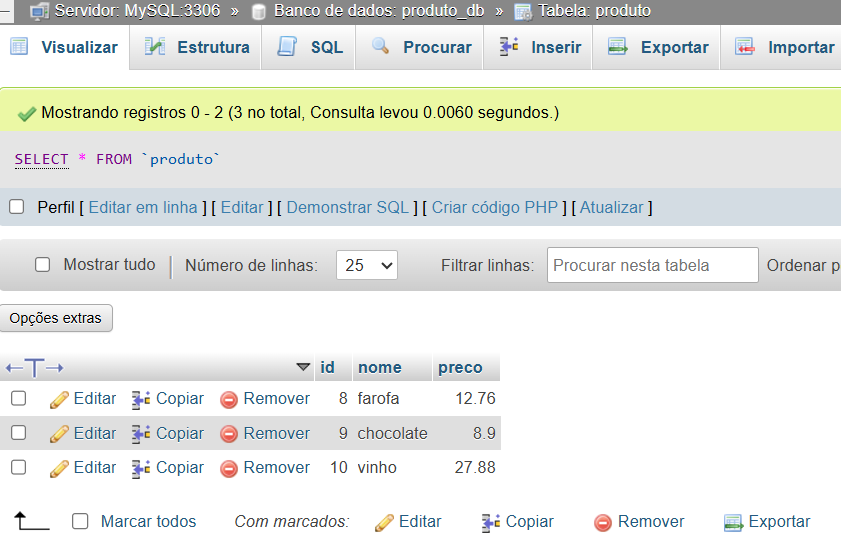
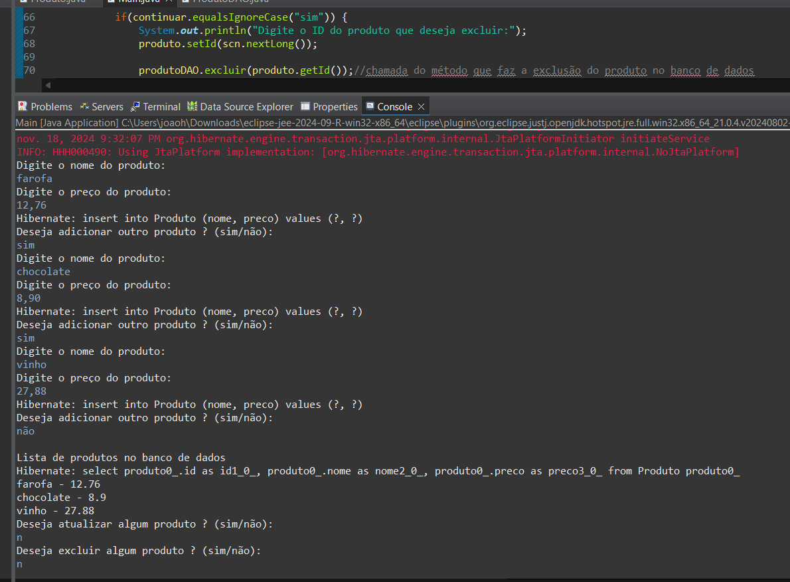

# JPA

Este programa se compõe de um sistema de gerenciamento de produtos, onde é possível adicionar, remover, modificar e listar os produtos presentes dentro do dentro do banco de dados usando JPA.
## 🚀 Começando

INSIRA NO SEU PROJETOS AS PRÓXIMAS ATUALIZAÇÕES;
TESTE O FUNCIONAMENTO DE CADA CLASSE CRIADA, PARA ISSO COMPILE A CLASSE E
CONFIRA NO CONSOLE E NO PHPMYADMIN;
A CADA MODIFICAÇÃO NO BANCO TIRE UM PRINT DA TELA E INSIRA NO README.MD;
### 📋 Pré-requisitos

De que coisas você precisa para instalar o software e como instalá-lo?

```
.
```

### 🔧 Instalação

* Usuário precisa digitar o nome de alguma produto para ser adicionada, o usuário poderá modificar ou remover o produto de acordo com o ID que ele informar, também tem a opção de listar os produtos presentes na banco de dados.

## 🛠️ Construído com

Ferramentas utilizadas e bibliotecas

* VS CODE

## 📌 Versão

* **Versão 1.0** 

## ✒️ Autores

* **João Henrique Santos da Silva** - *Trabalho Inicial* - JPA

## CLI e DB
* **Banco de dados e command line**






